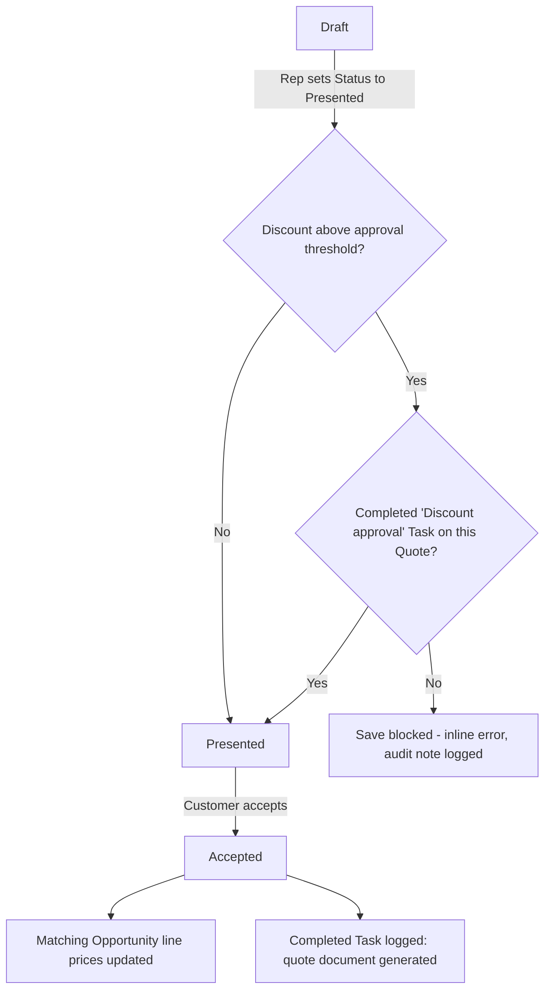

## Overview

The Quote Builder component gives reps a quick view of which open opportunities are ready to be turned into a quote. Behind the scenes, Quote records are protected by automation that runs every time a quote is saved: it stops a quote from being presented to a customer if its discount is too steep without a completed approval, and once a customer accepts a quote, it pushes the agreed prices back onto the Opportunity and logs that the quote document was generated. This keeps pricing consistent between the Opportunity, the Quote, and (later) the Order without anyone having to remember to update all three by hand.



## Prerequisites

- Profile / permission set with read access to Opportunity and Quote (the component only reads, it does not require Quote create permission itself).
- The Quote Builder component must already be placed on a page by an admin — it does not ship on any page by default.
- PriceRuleEngine's account tiers and discount-approval thresholds must be configured, since both quote pricing and the discount gate depend on them.
- Discount approvals are recorded as a plain Task (no custom object) — someone with access to log a Task against the Quote must create one with Subject starting `Discount approval` and Status `Completed` before an over-threshold quote can be presented.

## Steps to Navigate

1. Click the gear icon in the top-right, then click **Edit Page** (Lightning App Builder) on the Home page, App page, or record page where reps should see quotable deals.
2. Drag the **Quotable Opportunities** component onto the page.
3. Click **Save**, then **Activate** if prompted, to assign the page to the right app/profile.

```screenshot
id: quote-management-app-builder
alt: Lightning App Builder with the "Quotable Opportunities" component dragged onto a Home page
step: Open Lightning App Builder for a Home page and add the Quote Builder component
url_pattern: /lightning/app/AppLauncher
```

4. Reps open that page and see a **Quotable Opportunities** card listing each opportunity's name, stage, and amount.

```screenshot
id: quote-management-quotable-list
alt: Quotable Opportunities card listing open opportunities with their stage and amount
step: Open the Home page that has the Quote Builder component
url_pattern: /lightning/page/home
```

## Use Cases

### View opportunities ready to be quoted

1. Open the page where the Quote Builder component was placed.
2. The **Quotable Opportunities** card lists up to 25 open (not-closed) opportunities that already have at least one product line, most recently modified first.
3. Each row shows the opportunity's Name, Stage, and Amount so the rep can decide which deal to quote next.

> The component itself is read-only — it does not include a button to generate the quote. Quote creation from an opportunity's line items happens through Apex (for example, as part of the lead-to-cash flow), not by clicking anything in this component today.

### A quote is generated from an opportunity's line items

1. When quote generation runs for an Opportunity, a Draft Quote is created named `<Opportunity Name> — Quote`, linked to the opportunity and its price book, with an Expiration Date 30 days out.
2. Every Opportunity Line Item is copied onto the Quote as a Quote Line Item with the same quantity.
3. If the opportunity line has a positive List Price, the quote line's price is recalculated using PriceRuleEngine for the account's tier and the product's family; otherwise the opportunity line's existing Unit Price is copied as-is.

### Present a quote within discount policy (standard path)

1. On the Quote, change **Status** to **Presented** and save.
2. The system calculates the quote's blended discount (list price total vs. sold price total across all quote lines).
3. Since the discount is under the approval threshold for the account tier, the save completes normally and the quote is now Presented.

### Present a quote that needs discount approval (exception path)

1. On the Quote, change **Status** to **Presented** and save.
2. The blended discount exceeds the approval threshold for this quote's tier and total, and there is no Task on the Quote with Subject starting `Discount approval` and Status `Completed`.
3. The save is blocked with an inline error naming the discount percentage, and an audit note is recorded. Status stays at its previous value.
4. **Correction:** a manager or sales ops logs a Task on the Quote (Subject starting `Discount approval`, Status `Completed`) to record the approval, then the rep re-saves the Status change to Presented, which now passes the gate.

### Accept a quote (syncs pricing and logs the document)

1. On the Quote, change **Status** to **Accepted** and save.
2. For each Quote Line Item, any Opportunity Line Item on the linked Opportunity that uses the same price book entry has its Unit Price updated to match the accepted quote line's price — the Opportunity Amount follows automatically.
3. A background job then logs a completed Task on the Quote recording the quote total and expiration date, standing in for the generated quote document.
4. This runs per accepted quote, so accepting several quotes in the same save (bulk update) syncs and logs each one independently.

## Validations & Business Rules

- **Presentation gate:** a Quote can't move to Status `Presented` if its blended discount exceeds the approval threshold for its account tier/total (`PriceRuleEngine.requiresApproval`) unless a Task with Subject like `Discount approval%` and Status `Completed` already exists on that Quote. Enforced in the before-update trigger; the save is blocked with an inline error and an audit note is written.
- **Acceptance sync:** when Status changes to `Accepted` (after-update), matching Opportunity Line Items are updated to the accepted quote line's Unit Price. This update temporarily bypasses the OpportunityLineItem trigger so it doesn't re-fire other opportunity automation.
- **Document logging:** accepting a quote also queues a job that inserts a completed Task summarizing the quote total and expiration, simulating quote document generation.
- **Automation bypass:** all Quote trigger logic can be skipped via `TriggerControl.isBypassed('Quote')` — used by backend processes (for example, an end-to-end lead-to-cash helper) that need to set a Quote's Status programmatically without re-running the gate or sync.
- **Quote generation defaults:** Expiration Date is always set 30 days from creation; quote line pricing only goes through PriceRuleEngine when the source opportunity line has a positive List Price.
- **Quotable Opportunities list:** only shows open opportunities that already have at least one product line, capped at 25, most-recently-modified first.

## Related Features

- Price Rule Engine — supplies the account-tier pricing and discount-approval thresholds this feature depends on.
- Order from Quote — picks up where an Accepted quote leaves off, converting it into an Order.
- Opportunity pricing sync — the reverse direction of the acceptance sync described above.
