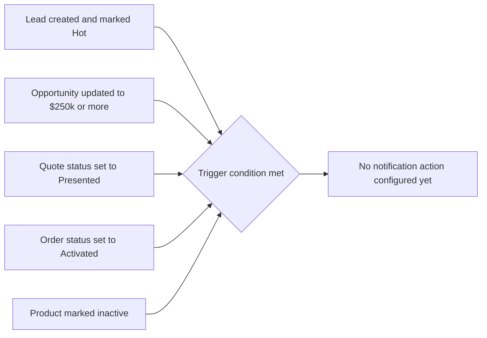

## Overview

The Sales Playbook Banner is a reminder strip an admin can drop onto Home, Record, or App pages that
reinforces the standard sales motion: qualify, price through the rule engine, quote, then order. Alongside
the banner, five milestone flows watch for specific events along that same pipeline — a large opportunity,
a hot new lead, an expiring quote, an activated order, and a retired product.

As currently built, each milestone flow only evaluates its trigger condition — none of them has an email
alert, task, or Chatter post configured, so nothing is visibly sent when a record matches. This page
documents the banner (which works today) and the current state of each milestone trigger, so support can
explain why a "I should have gotten an alert" ticket has no visible outcome yet.



## Prerequisites

- 'Customize Application' permission (or a System Administrator profile) to edit pages in Lightning App Builder
- The five milestone flows are org-wide automation — no per-user setup is required for them to evaluate, since they run automatically whenever a matching record is saved

## Steps to Navigate

1. Navigate to the page where the banner should appear (for example, the Home page or an Opportunity record).
2. Click the gear icon in the top-right, then click **Edit Page** to open Lightning App Builder.
3. In the Components panel, find **Sales Playbook Banner** and drag it onto the page canvas, typically above the existing components.
4. Click **Save**.
5. If prompted for activation, choose where the page should apply (org default, specific app, or specific profiles) and click **Save** again.
6. Click **Back** to leave App Builder and confirm the reminder text appears at the top of the page.

```screenshot
id: sales-playbook-alerts-app-builder-canvas
alt: Lightning App Builder canvas with the Sales Playbook Banner component placed on the page
step: Drag the Sales Playbook Banner component onto the page canvas in Lightning App Builder
url_pattern: /lightning/setup/FlexiPageList/home
```

## Use Cases

### Add the banner to the Home Page

1. From the Home page, click the gear icon, then **Edit Page**.
2. Drag **Sales Playbook Banner** onto the page and click **Save**.
3. Activate the page as the org default (or for the relevant app/profile) so reps see it every time they land on Home.

```screenshot
id: sales-playbook-alerts-home-banner
alt: Sales Playbook reminder banner displayed at the top of the Home page
step: Open the Home tab after adding the Sales Playbook Banner component
url_pattern: /lightning/page/home
```

### Add the banner to a record page (e.g. Opportunity)

1. Open any Opportunity record, click the gear icon, then **Edit Page**.
2. Drag **Sales Playbook Banner** onto the record page layout and click **Save**.
3. Activate the page for the relevant record type or app so it shows on every Opportunity record reps open.

```screenshot
id: sales-playbook-alerts-opportunity-banner
alt: Sales Playbook reminder banner displayed at the top of an Opportunity record page
step: Open an Opportunity record after adding the Sales Playbook Banner component to the Opportunity record page
url_pattern: /lightning/r/Opportunity/{recordId}/view
actions:
  - open_record: Opportunity
```

### Milestone triggers that currently take no action

Each of these is an Active, auto-launched flow that fires after a record save. As shipped, none of them
has an action element attached, so meeting the condition does not yet produce a visible notification.

1. **Big Deal Alert** — fires when an Opportunity is updated with `Amount` of $250,000 or more.
2. **Lead Followup Reminder** — fires when a new Lead is created with `Rating = Hot`.
3. **Quote Expiry Alert** — fires when a Quote's `Status` is updated to `Presented`.
4. **Order Activation Confirmation** — fires when an Order's `Status` is updated to `Activated`.
5. **Product Retirement Notice** — fires when a Product is updated so that `Active = false`.

In each case, an admin can confirm the trigger exists (and see that it has no action) in Setup, but reps and customers currently receive no email, task, or Chatter post from these flows.

```screenshot
id: sales-playbook-alerts-flow-list
alt: Setup Flows list showing the five milestone alert flows in Active status
step: Go to Setup and search for Flows to view the milestone alert flow list
url_pattern: /lightning/setup/Flows/home
```

## Validations & Business Rules

- Automation: `Big Deal Alert` — Opportunity, after save on update, filters on `Amount >= 250000`. No action element is defined.
- Automation: `Lead Followup Reminder` — Lead, after save on create, filters on `Rating = "Hot"`. No action element is defined.
- Automation: `Quote Expiry Alert` — Quote, after save on update, filters on `Status = "Presented"`. No action element is defined.
- Automation: `Order Activation Confirmation` — Order, after save on update, filters on `Status = "Activated"`. No action element is defined.
- Automation: `Product Retirement Notice` — Product2, after save on update, filters on `IsActive = false`. No action element is defined.
- Because none of the five flows above has a configured action, they currently have no observable effect on the record or on any user — they exist as trigger scaffolding only. If a stakeholder expects an email, task, or Chatter alert from one of these events, that action still needs to be added to the flow.
- The banner's reminder text is static and hard-coded in the component markup — it cannot be edited from Setup or Lightning App Builder; changing the wording requires a developer to update the component and redeploy.

```callout
type: note
The milestone flows above are named for the alerts they are intended to send, but ship with no configured
action. Treat "why didn't I get notified" reports for a big deal, hot lead, expiring quote, activated
order, or retired product as expected until an action step is added to the corresponding flow.
```

## Related Features

- None documented yet.
