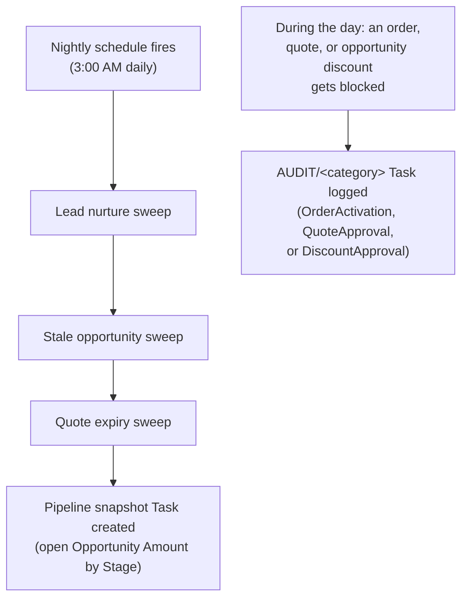

## Overview

Every night, a scheduled job runs the pipeline's routine cleanup in a fixed order: nudging stale leads,
flagging or auto-closing stale opportunities, expiring unactioned quotes, and finally logging a snapshot of
the whole org's open pipeline by stage. Separately, whenever a discount or a credit check gets blocked during
the day (a quote that can't be presented, an opportunity discount that needs review, or an order that fails
credit), a matching audit entry is logged in real time. Both the nightly snapshot and the audit entries show
up as plain Salesforce Tasks that aren't linked to any specific record — sales ops needs to query Activities
by Subject to find them, rather than looking at a single record's related list.



## Prerequisites

- Access to Tasks/Activities (list view or report, filtered by Subject) to review the nightly snapshot and audit trail

## Steps to Navigate

1. Click the **App Launcher** and search for **Tasks**.
2. Create or open a list view filtered on **Subject starts with** `Pipeline snapshot` to see the nightly pipeline totals, or **Subject starts with** `AUDIT/` to see the blocked-discount/credit-check audit trail.

```screenshot
id: nightly-jobs-audit-trail-tasks-list
alt: Task list view filtered to Pipeline snapshot and AUDIT tasks
step: Open the Tasks tab and filter to a list view showing Subject
url_pattern: /lightning/o/Task/list
```

## Use Cases

### The nightly job chain runs

1. At 3:00 AM daily, the scheduled job runs four cleanup jobs in this exact order: the lead nurture sweep,
   the stale-opportunity sweep, the quote-expiry sweep, then the pipeline snapshot.
2. Each of the first three jobs' effects are documented on their own feature pages (Lead Scoring &
   Assignment, Opportunity Pipeline Guardrails, and Quote Builder, respectively) — this page only covers the
   scheduling and the final snapshot step.

### Reviewing the previous night's pipeline snapshot

1. A sales ops user opens a Task list view filtered to Subject `Pipeline snapshot …`.
2. Each night's Task (dated and titled e.g. "Pipeline snapshot Jul 27, 2026") has a description listing the
   total open Opportunity Amount for every stage, as of that run — a simple daily trend record, not tied to
   any single Opportunity or Account.

### Investigating why a discount or credit check was blocked

1. A rep reports that a quote couldn't be moved to Presented, a deal's discount got flagged on entering
   Negotiation, or an order failed to activate.
2. Sales ops opens a Task list view filtered to Subject starts with `AUDIT/` and finds a matching entry —
   `AUDIT/QuoteApproval`, `AUDIT/DiscountApproval`, or `AUDIT/OrderActivation` — whose description explains
   exactly what was blocked and why (e.g. the discount percentage, or the order total that failed credit).
3. Since these audit Tasks aren't linked to the record involved, they're found by searching Activities, not by
   opening the Quote/Opportunity/Order's own related list.

## Validations & Business Rules

- **Schedule:** the nightly chain is intended to run once daily at **3:00 AM**, in this fixed order: lead
  nurture sweep, stale-opportunity sweep, quote-expiry sweep, pipeline snapshot. Confirm with your admin that
  this schedule is active in Setup > Scheduled Jobs if the nightly effects (nurture Tasks, stale-opportunity
  changes, expired quotes, snapshot Tasks) aren't appearing.
- **Pipeline snapshot Task:** one per night, `Subject = "Pipeline snapshot <date>"`, `Status = Completed`,
  with a description of open-pipeline totals per stage. It is not related to any Account/Opportunity
  (`WhatId`/`WhoId` are both blank) — it's a standalone daily log entry.
- **Audit categories logged in real time (not part of the nightly chain):**
  - `AUDIT/OrderActivation` — logged when an order fails its credit check during activation.
  - `AUDIT/QuoteApproval` — logged when a quote is blocked from moving to Presented because its discount
    needs an approval task first.
  - `AUDIT/DiscountApproval` — logged when an opportunity's discount review task is created on entering
    Negotiation/Review.
- **Audit Tasks are also unattached** (`WhatId`/`WhoId` blank) — like the pipeline snapshot, they're found by
  searching/filtering Activities by Subject, not from the related Order/Quote/Opportunity's own Task list.
- None of this creates or changes any Lead/Opportunity/Quote/Order field directly — the nightly chain's
  record-level effects (nurture Tasks and emails, stale-opportunity nudges/auto-close, quote expiry) belong to
  the individual features that perform them; this page covers only the scheduling and the snapshot/audit
  logging layer common to all of them.

## Related Features

- Lead Scoring, Assignment & Conversion — its stale-lead nurture sweep is the first job in the nightly chain.
- Opportunity Pipeline Guardrails — its stale-opportunity sweep is the second job in the nightly chain, and its discount-review step is one of the real-time audit categories.
- Quote Builder — its quote-expiry sweep is the third job in the nightly chain, and its approval gate is one of the real-time audit categories.
- Order Fulfillment & Activation — its credit-check failures are logged under the OrderActivation audit category.
