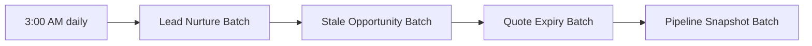

## Overview

Every night at 3:00 AM, four maintenance jobs run automatically in a fixed order to keep the pipeline honest:
following up on stale leads, cleaning up opportunities that have gone quiet, expiring quotes that were never
answered, and recording a snapshot of pipeline value by stage. Separately, whenever an automated rule blocks or
flags something elsewhere in the pipeline — a large discount, a failed credit check — the action is logged to
a shared audit trail so sales ops has one place to review what automation did and why.



## Prerequisites

- No end-user setup is required for the nightly jobs themselves — they are org-wide scheduled automation
- Reviewing the audit trail across records you don't own requires 'View All Data' or a permission set granting broad Task visibility

## Steps to Navigate

1. Click the **App Launcher** and search for **Tasks**.
2. Open a list view (or create one) filtered on **Subject starts with `AUDIT/`**.
3. Review the **Description** of each entry for what was blocked or flagged and why.

```screenshot
id: nightly-ops-audit-task-list
alt: Task list view filtered to Subject starting with AUDIT showing governance log entries
step: Open the Tasks tab and view a list filtered to Subject starts with AUDIT/
url_pattern: /lightning/o/Task/list
actions:
  - open_app_launcher
  - search_app_launcher: Tasks
  - click_app_launcher_result: Tasks
```

## Use Cases

### Nightly job chain runs automatically

1. At 3:00 AM every day, the scheduled job runs the four batches in order: lead nurture, stale opportunity cleanup, quote expiry, then pipeline snapshot.
2. Each batch commits its own changes independently — a later batch's overlap with an earlier one (for example, an opportunity that closed via the stale batch) is picked up correctly since they run in sequence, not in parallel.
3. No user action is needed; this is purely background automation.

### Opportunity untouched 30-90 days (flagged)

1. An open Opportunity's Close Date passes 30 days in the past, but not yet 90 days.
2. The nightly batch creates a task **"Stale deal — revive or close: {Opportunity Name}"**, due in 3 days, assigned to the opportunity owner.
3. The owner reviews the deal and either updates the Close Date / advances the stage, or closes it manually.

### Opportunity untouched 90+ days (auto-closed lost)

1. An open Opportunity's Close Date passes 90 days in the past without being updated.
2. The nightly batch automatically sets **Stage** to **Closed Lost** — no task, since the opportunity is simply closed out.
3. The owner sees the opportunity already closed the next time they look at their pipeline; if that's wrong (the deal is still live), they'll need to reopen/re-stage it manually.

### Reviewing the pipeline snapshot

1. Every night after the other three jobs finish, a completed task **"Pipeline snapshot {date}"** is created (on the running user), with a description listing the total open Amount for every stage in the pipeline that night.
2. Sales ops can scan consecutive nightly snapshots to see how the funnel's stage totals moved day over day, without needing a separate reporting tool.

### Reviewing the sales ops audit trail

1. Discount-approval blocks (see [[opportunity-pipeline-guardrails]] and [[quote-generation-approval]]) and failed credit checks (see [[order-activation-fulfillment]]) are each logged as a completed Task with Subject **"AUDIT/{category}"** — for example `AUDIT/DiscountApproval`, `AUDIT/QuoteApproval`, `AUDIT/OrderActivation`.
2. Sales ops filters the Task list to Subjects starting with `AUDIT/` to see every governance action across the org in one place, regardless of which record it happened on.
3. Each entry's Description holds the specific note — which record, what percentage or amount, and what was blocked.

## Validations & Business Rules

- Automation: `NightlyPipelineJobsSchedulable` runs daily at 3:00 AM, launching (in order) `LeadNurtureBatch` (200/batch), `StaleOpportunityBatch` (100/batch), `QuoteExpiryBatch` (100/batch), then `PipelineSnapshotBatch` (500/batch).
- Automation: open opportunities with a Close Date more than 30 days in the past get a "Stale deal — revive or close" task (due in 3 days); those more than 90 days in the past are automatically set to `Closed Lost` instead (no task, since it's already resolved).
- Automation: the pipeline snapshot job sums open opportunity Amount by Stage and logs it as one completed Task ("Pipeline snapshot {date}") with one line per stage in the Description.
- Automation: `SalesOpsAuditService` centralizes governance logging — every entry is a completed Task with Subject `AUDIT/{category}`, Description holding the specific note, dated today. It is `without sharing`, so entries are written regardless of the running user's access to the underlying record.
- Categories currently logged: `DiscountApproval` (opportunity discount task created), `QuoteApproval` (quote presentation blocked), `OrderActivation` (credit check failed).

```callout
type: note
The nightly chain runs the four batches strictly in sequence within one scheduled job, not as independent
schedules — if `LeadNurtureBatch` were to fail or run long, the batches after it in the chain still get queued
since `Database.executeBatch` only enqueues the job rather than waiting for it to finish.
```

## Related Features

- [[lead-scoring-assignment-conversion]] — the lead nurture batch is the first job in the nightly chain.
- [[opportunity-pipeline-guardrails]] — discount-approval blocks are logged to this audit trail.
- [[quote-generation-approval]] — quote expiry is part of the nightly chain, and blocked presentations are logged here.
- [[order-activation-fulfillment]] — failed credit checks are logged to this audit trail.
