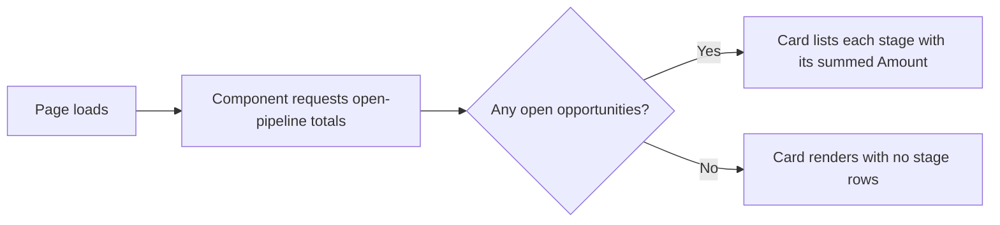

## Overview

The Pipeline Dashboard is a small card component that sales managers and reps can drop onto a Home page, an
App page, or an Opportunity record page to see the open pipeline broken down by stage without running a
report. For every stage that has at least one open opportunity, it shows the stage name and the summed
**Amount** of every open opportunity sitting in that stage, refreshed each time the page loads.



## Prerequisites

- Read access to Opportunities — the totals only ever include records the running user (or the page's
  configured context) can see, since the underlying query respects sharing
- A System Administrator (or someone with page-editing rights) needs to add the **Pipeline by Stage**
  component to a page once, via Lightning App Builder, before anyone else can see it

## Steps to Navigate

1. Click the gear icon in the top-right, then click **Edit Page** (on a Home, App, or Opportunity record page).
2. Drag the **Pipeline by Stage** component from the component palette onto the page.
3. Click **Save**, then **Activate** if this is the first time the page has been activated.
4. Navigate to the page to see the live pipeline-by-stage totals.

```screenshot
id: pipeline-dashboard-app-builder
alt: Lightning App Builder with the Pipeline by Stage component placed on a page
step: Edit a Home page and drag the Pipeline by Stage component onto it
url_pattern: /lightning/setup/FlexiPageList/home
```

```screenshot
id: pipeline-dashboard-card
alt: Pipeline by Stage card showing each open sales stage with its summed Amount
step: View a page that has the Pipeline by Stage component activated
url_pattern: /lightning/page/home
```

## Use Cases

### Viewing pipeline totals with open deals in the funnel

1. A sales manager opens a Home or App page that has the Pipeline by Stage component.
2. The card lists one row per stage that currently has at least one open (not Closed) opportunity, showing
   the stage name and the sum of **Amount** across every open opportunity in that stage.
3. The totals reflect only what the viewer has access to — two users with different sharing access can see
   different totals on the same page.

### No open pipeline to show

1. The running user has no open opportunities they can see (for example, a brand-new rep, or everything is
   already closed).
2. The card still renders with its **Pipeline by Stage** title, but with no stage rows underneath, since
   there is nothing to sum.

## Validations & Business Rules

- Automation/query: `SalesMetricsService.pipelineByStage()` sums **Amount** across all Opportunities where
  `IsClosed = false`, grouped by **StageName**; opportunities with no Amount contribute nothing to their
  stage's total but are still counted implicitly by the grouping.
- The method runs `with sharing` and is marked `cacheable=true`, so results respect the running user's
  Opportunity sharing rules and may be served from the Lightning Data Service cache rather than a fresh query
  on every view.
- Stages with zero open opportunities simply don't appear as a row — the card does not list every possible
  stage, only the ones currently represented in the open pipeline.

```callout
type: note
This card is read-only — it doesn't let a user click through to filter or drill into a stage. To act on
individual deals, use the Opportunity list views or the [[opportunity-pipeline-guardrails]] stage path
instead.
```

## Related Features

- [[opportunity-pipeline-guardrails]] — the stage-progression rules that determine which stage an open
  opportunity is sitting in when this dashboard sums it.
- [[nightly-sales-operations]] — the nightly pipeline snapshot batch records the same stage-by-stage open
  Amount total as a historical Task log, for day-over-day comparison.
